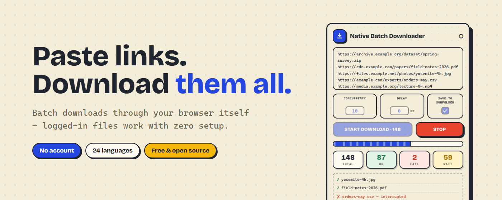
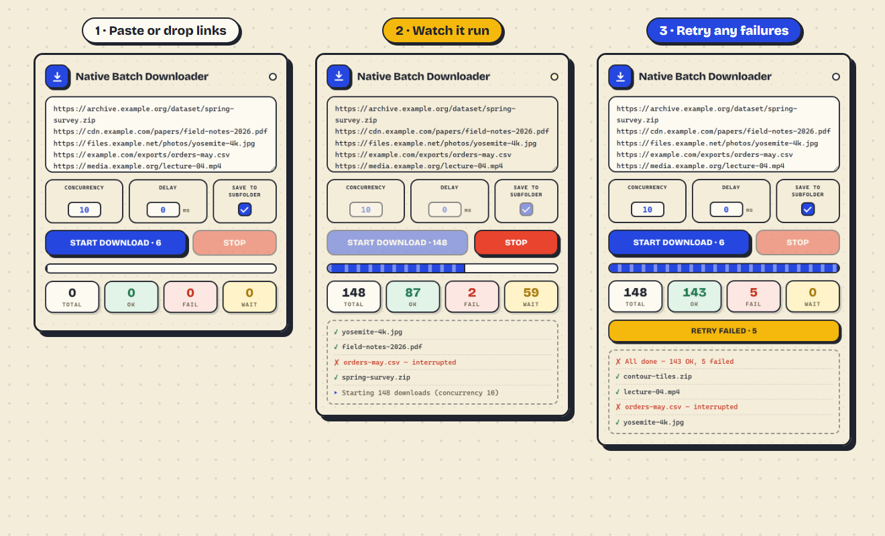

# Native Batch Downloader

> 365 Open Source Plan #001 · Chrome extension for batch downloading via native browser channel

Paste a list of links and download them all at once. Because it downloads through the browser's own channel -- the same path as clicking a link yourself -- **files that require a login work too**: you stay signed in automatically, with no setup.

[中文](README.zh.md) | English

## How It Works

Click the toolbar icon, paste your URLs (one per line), set the delay and concurrency, then hit **Start Download**.

In plain terms: anything you could download by clicking a link in this browser, you can grab here in bulk -- and you stay logged in automatically. The downloads are made by the browser itself, exactly as if you had clicked each link yourself, so your login always comes along.

The download queue runs in the background, so it keeps going even if you close the popup -- reopen it anytime to see live progress.

## Features

- **Logged-in downloads just work** -- files go through the browser's own download channel, so you stay signed in automatically. Anything you can normally download while signed in, you can batch here.
- **Concurrency & delay control** -- set how many files download in parallel (1-200) and an optional minimum gap between download starts (in ms) -- every start is spaced, including the first batch, so rate-limited servers aren't hit with a burst.
- **Remembers your settings** -- concurrency, delay, and the folder toggle persist across sessions (synced to your browser profile).
- **Badge progress** -- the toolbar icon shows the remaining count while a batch runs, so progress stays visible with the popup closed.
- **Retry failed** -- after a batch ends, one click re-queues every URL that failed, was interrupted, or was abandoned by Stop.
- **Drop a list file** -- drag a `.txt`/`.csv` of URLs onto the popup to load it into the editor.
- **Tidy subfolder** -- files save into `BatchDL/<date>/` inside your Downloads folder (toggleable), so a 200-file batch doesn't bury everything else.
- **Real-time progress** -- live stats for total / succeeded / failed / waiting, with a progress bar.
- **Any file type** -- PDF, images, videos, archives, executables -- anything a direct URL points to.
- **Keeps running in the background** -- closing the popup doesn't stop the queue; reopen anytime to resume the live view.
- **Smart de-duplication** -- duplicate URLs download once, and skipped invalid/duplicate lines are reported in the log.
- **Sensible filenames** -- files keep their proper names automatically, whether the name comes from the link or from the server.
- **24 languages** -- AR, BN, DE, EN, ES, FA, FIL, FR, HI, ID, IT, JA, KO, NL, PL, PT-BR, RU, TH, TR, UK, UR, VI, ZH-CN, ZH-TW.

## Installation

Requires Chrome 110 or newer (declared in the manifest; the Web Store won't offer it to older versions).

**From Chrome Web Store (recommended):**

Install directly from the [Chrome Web Store](https://chromewebstore.google.com/detail/native-batch-downloader/fmmihnoplefjcfoggfgpeiomlbmjnfpm).

**Manual installation (development):**

1. Download or clone this repository.
2. Open `chrome://extensions/` in Chrome.
3. Enable **Developer mode** (top-right toggle).
4. Click **Load unpacked** and select the project folder.
5. The extension icon appears in the toolbar -- click it to open the popup.

## Usage

1. Click the extension icon in the toolbar.
2. Paste direct download URLs into the text area, **one per line** -- or drag a `.txt`/`.csv` file of URLs onto the popup. The Start button shows how many valid links it found. An unstarted list is kept if the popup closes -- reopen and it's still there.
3. Adjust **Concurrency** (default 10) and **Delay** (default 0 ms) if needed, and choose whether files go into a dated `BatchDL/<date>/` subfolder (on by default). All three settings are remembered for next time.
4. Click **Start Download** (or press **Ctrl/Cmd+Enter** in the text area).
5. Watch the log and stats update in real time. You can close the popup -- downloads keep going, and the toolbar badge shows how many are left. Click **Stop** to cancel the batch, including downloads in progress.
6. If anything failed, a **Retry Failed** button appears after the batch ends -- one click re-queues exactly those URLs.

## Important Notes

### URLs must be direct links

If a website generates a temporary download URL via JavaScript after you click a button (e.g. cloud storage "Download" buttons), pasting the page URL won't work. You need the actual file URL.

### Login state matters

The extension can carry cookies because it uses the browser's own request pipeline. If the target site requires login and you haven't logged in within the browser, you'll still get a 403.

### Chrome's per-domain connection limit

Chrome only transfers about **6 files from the same site at once**. Even if you set concurrency to 100, downloads from a single site go roughly 6 at a time -- the rest wait their turn. Downloading from several different sites doesn't have this limit.

### Dangerous file type warnings

Executable files (`.exe`, `.bat`, etc.) may trigger Chrome's built-in security prompt, which interrupts the automated flow. No extension can suppress this -- it's a Chrome safety rule.

**Workaround**: go to `chrome://settings/security` and set Safe Browsing to **No protection**. Remember to switch it back after you're done.

PDFs and other common document types are not affected.

### Large delay + closed popup

Chrome may put the extension's background process to sleep after a period of inactivity. If you set a large **Delay** (e.g. several seconds) and close the popup, that nap can land in a wait gap with no download in flight to wake it up -- the batch silently pauses. Reopening the popup resumes it automatically. With the popup open, or with delay at 0, this doesn't happen.

## Development

No build step -- plain HTML/CSS/JS, loads unpacked as-is.

- After changing the `title`/`start`/`stop`/`retryFailed` messages or adding a locale, regenerate the bundled display-font subsets: `pip install fonttools brotli`, then `python scripts/subset-display-fonts.py` (fails loudly on missing glyphs).
- Build the Web Store upload zip: `python scripts/package.py`

## About the 365 Open Source Plan

This is project #001 of the [365 Open Source Plan](https://github.com/rockbenben/365opensource).

One person + AI, 300+ open-source projects in one year. [Submit your idea →](https://my.feishu.cn/share/base/form/shrcnI6y7rrmlSjbzkYXh6sjmzb)

## License

[MIT](LICENSE)
